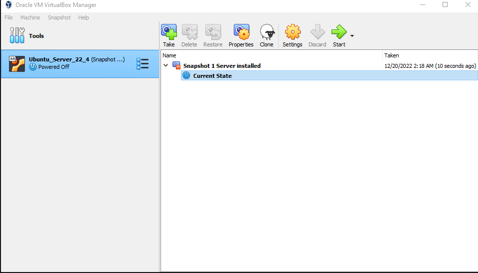
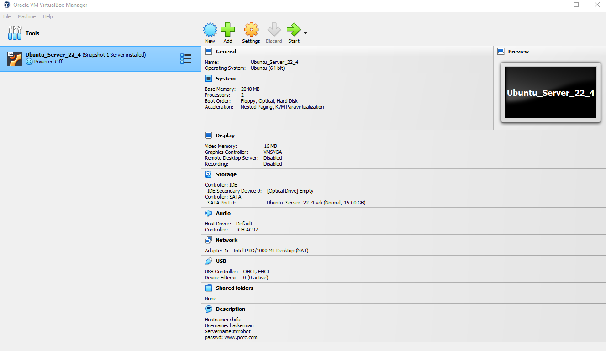
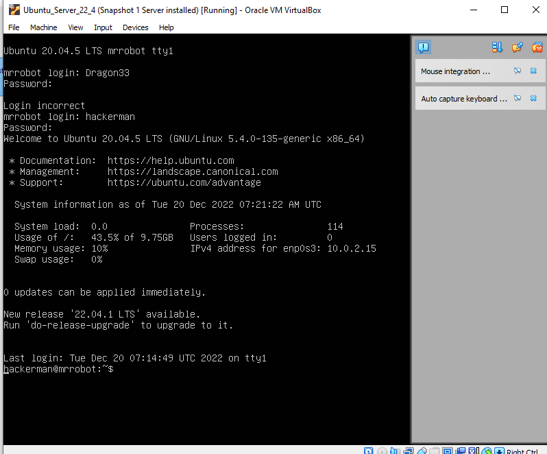
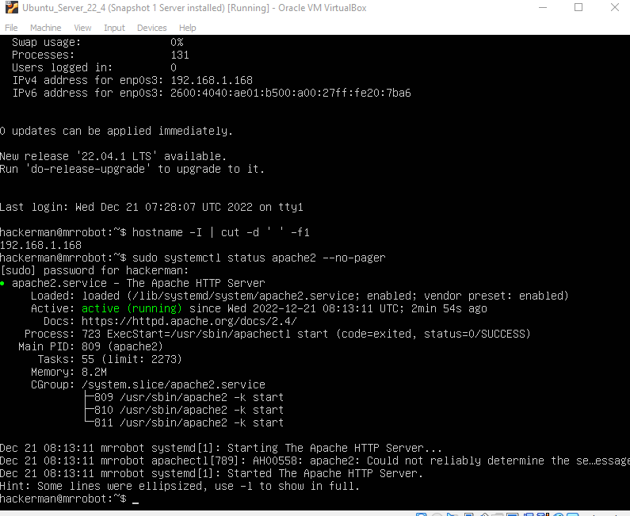
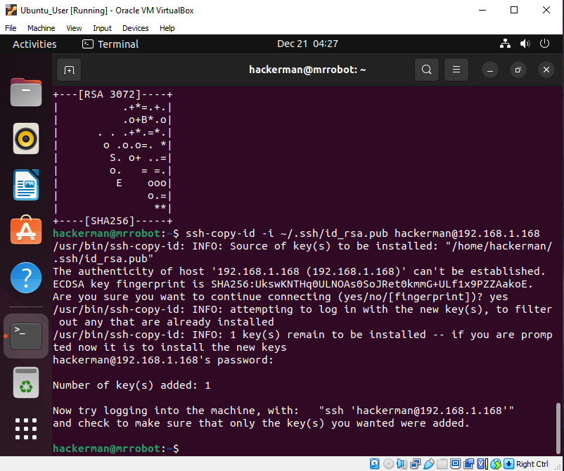
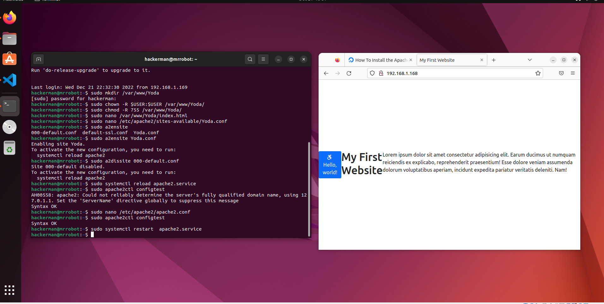
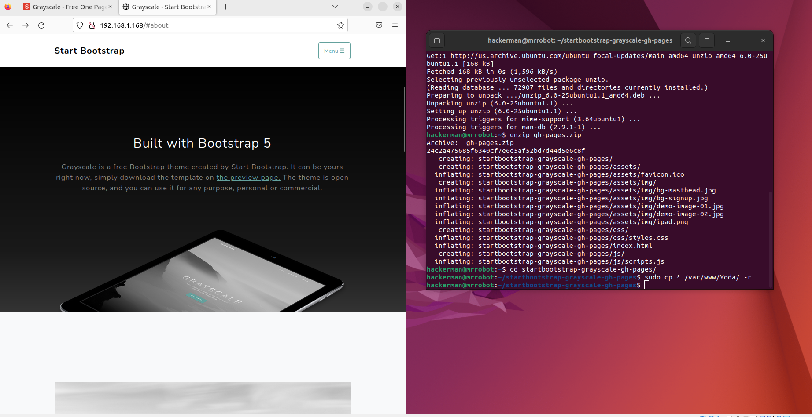

# Deliverable 1 

> Tutorial can be found [here](https://www.digitalocean.com/community/tutorials/how-to-install-the-apache-web-server-on-ubuntu-22-04)

## Concepts I don't Understand

|Term | Definition | 
|--------| ------------| 
|Apache| Free open-source software cross-platform web server software|
|UFW | Uncomplicated Firewall, a program for managing a netfilter firewall designed to be easy to use| 
|SSH | Linux command which provides a secure encrypted connection between two hosts over an insecure network| 
|SSL| Certificate which  is used to encrypt a site's information and create a more secure connection|
|UMask| Four digit octal number that UNIX uses to determine the file permission for newly created files| 

### What is a web server? Hardware and Software side
On the hardware side of a web server it's a host that has the hardware capabilities run said server. It also hosts all the software needed to run the web server such as HTML. 
The software side is data based. It runs the protocol and applications needed to run the server. Sending and receiving data while providing a secure connection is the role on the software side. 

### What are some different web server applications?

There are many types of web server applications such as: 
* Appache HTTP server 
* Microsoft Internet Information Services 
* Nginx 
* Lighttpd
* Glassfish 
* Caddy

### What is virtualization? 

Virtualization in simple terms is a “fake” (virtual machine) inside another machine. In other words an application on a client runs an separate OS (Windows, Macos, Linux). It uses some of the hardware from the client but the client isn't affected by anything happening in the VM.

### What is virtualbox?

Virtual Box is on of many virtual machine softwares that are available. One benefit for virtual box is that it's free to use. The image blow shows the UI of virtual box and the settings that would be recommend for basic usage. 

### What is a virtual machine?

A virtual machine is a "fake" computer inside another computer. It a software than runs another OS in your computer. Note it's entirely separate from your physical machine but it uses your hardware to run said machine. 

### What is Ubuntu Server? 

An Ubuntu Server is a product from the open-source software ubuntu. It's a sever application thats simple to use and understand for a small home network. Another benefit is the ability to assign super to make the role for the network administer easier. 

### What is firewall? 
 
 A firewall is a security system that monitors and controls incoming and outgoing traffic. It shields the network from any malicious attackers. 

 ### What is SSH 

SSH allows users to have secure access to a computer of a unsecured network. It's a network protocol that provides strong passwords and public key authentication, and can encrypt data communication between two computes. 

# Deliverable 2

Here is my install of the linux server on my vm machine. I later installed another ubuntu later on. 

This is the server settings for my linux server 

This screenshot shows the linux server complete install 

After logging back on I installed apache2 and verified it was running. 

After downloading I started to work on SSH and made a key to connect the user to the server. 

After SSH I began setting up the website, it's name along with a view configurations. I then opened my web page to ensure it was running

After a few touch up I finished my website
