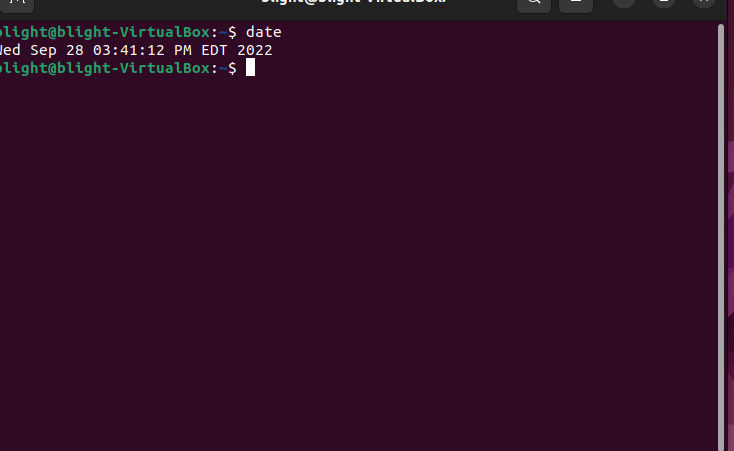

# Lab 3 Submission

## Question 1 

## Question 2 

| Program purpose     | Package Name     | Version                  |
| ------------------- | ---------------- | ------------------------ |
| Play a tetris game  | blockattack      | 2.7.0-1 amd64            |
| Play a video file   | dragonplayer     | 4:21.12.3-0ubuntu amd 64 |
| Browse the internet | epiphany-browser | 42.4-0ubuntu1            |
| Read your email     | gnome-gmail      | 2.9-3 all                |
| Play music          | gmpc-data        | 11.8.16-19 all           |

1. Which command is used to install? 
sudo apt install blockattack dragonplayer epiphany-browser gnome-gmail gmpc-data -y (-y is optional)

2. Which command is used to remove 
sudo apt remove blockattack dragonplayer epiphany-browser gnome-gmail gmpc-data -y

3. Which command is used to both install and remove 
sudo apt install blackattack+ dragonplayer- epiphany-browser- gnome-gmail+ gmpc-data+
'+' is used to install programs while '-' is used to remove programs

## Question 4

| command | what it does                                                   |
| ------- | -------------------------------------------------------------- |
| echo    | displays a line of text                                        |
| fortune | print a random, hopefully interesting, adage                   |
| cowsay  | configurable speaking/thinking cow                             |
| lolcat  | rainbow coloring effect for text console display               |
| figlet  | display large characters made up of ordinary screen characters |
| toilet  | display large colorful characters                              |
| rig     | Random Identity Generator                                      |