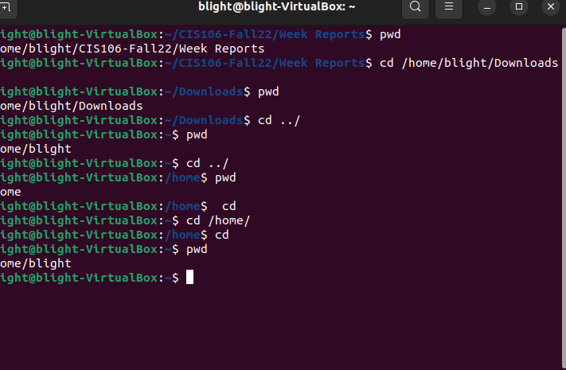
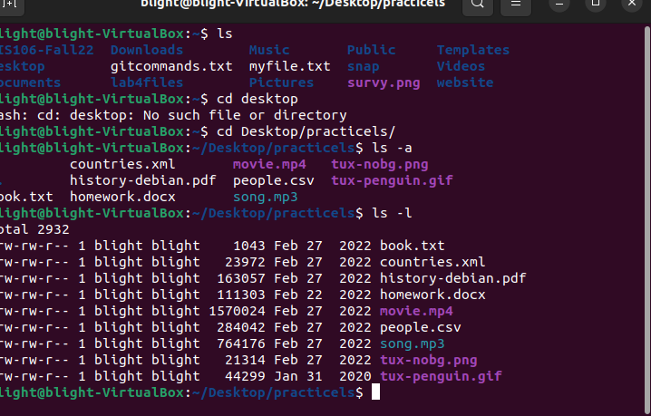

# Week 4 Report

## Question 1 

## Question 2

| Directory | Data stored in Directory                                          |
| --------- | ----------------------------------------------------------------- |
| bin       | Essential commands                                                |
| Dev       | Device files                                                      |
| Etc       | System Configuration files                                        |
| Home      | User Home Directories                                             |
| Media     | Mount Point for removable media.                                  |
| Opt       | Add-on software packages                                          |
| Proc      | Kernel information, process control system hardware information   |
| Srv       | information relating to services that run on the system           |
| Usr       | Software not essential for system operation, such as applications |
| Var       | Dedicated to variable data                                        |

## Question 3

| Command | What it does                                      | Syntax        | Example  |
| ------- | ------------------------------------------------- | ------------- | -------- |
| Pwd     | used for displaying the current working directory | pwd           | pwd      |
| Cd      | used to change the current directory, can also bring into home directory           | cd + filepath | cd /home |
| ls | used to display all the files inside the given directory| ls + directory| ls, ls /home| 

## Question 4

Learning to navigate the file system is essential when using linux. The file system is how the computer stores and organizes files. In the file system you have a current and parent directory. The difference between the two is the directory your currently working on is the current directory while a parent is a the previous directory. You also have your home directory and a home directory. Your home is the user data while the computer's home is the root. Next is the pathname which simply indicates the location of the file. Last there is relative and absolute path. Relative path is the location of your current directory while absolute path is starting from the root. There is much more to learn this is just the surface. 