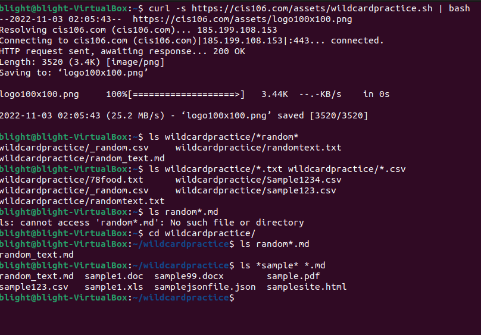
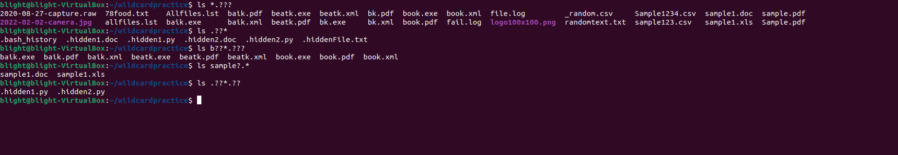
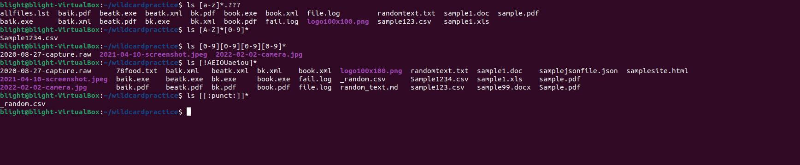

# Week 6 Report 

## * Wildcards 
The * Wildcard matches from 0 to any number of characters. 
* Examples: 
  * List all the text files in a directory
    * 'ls *.txt'
  * List all the files that start with word file
    * 'ls file' 
  * Copy all the mp4 files
    * 'cp Downloads/*.mp4 ~/Videos/Movies/' 

## ? Wildcards
The ? wildcard matches precisely one character. Useful when working with hidden files. 
* Examples: 
  * List all hidden files in the current directory
    *  'ls .??* '
 * List all the files that have a two character between letter b and k
   * 'ls b??k*
 * List all the files that have a single character between letter f and l
   * ls 'ls f?l*

## [] Wildcards 
The brackets wildcard match a single character in a range. Brackets will use and exclamation mark to reverse the match. 
* Examples: 
  * To match all files that have a vowel after letter f: 
    * 'ls f[aeiou]*' 
  * To match all files whose name begins with a letter from a-p or start with letters s or c
    * ' ls [a-psc]
  * To match all files that have a range of letters after f:
    * 'ls f[a-z]

## Brace Expansion {}
It's not a wildcard but another feature of bash that allows you to generate arbitrary strings to use with commands. 
* Example: 
  * To create a whole directory structure in a single command: 
    * mkdir -p music/{jazz,rock}/{mp3files,videos,oggfiles}/new{1..3}
  * Remove multiple files in a single directory 
    * rm -r {dir1,dir2,dir3,file.txt,file.py}
  * Create a N number of files 
    * touch website{1..5}.html

## Practice

### Practice 1: 

### Practice 2: 

### Practice 3: 

