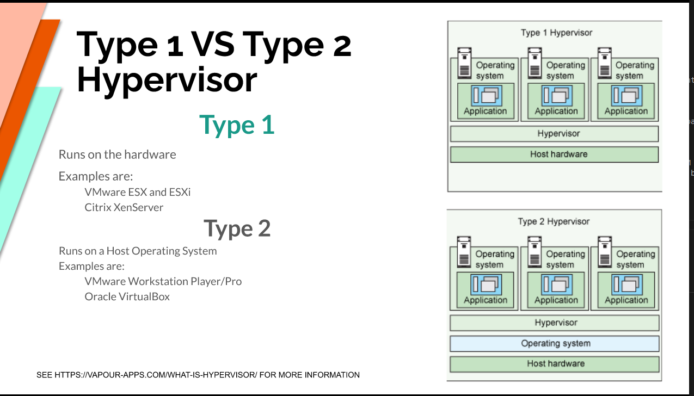
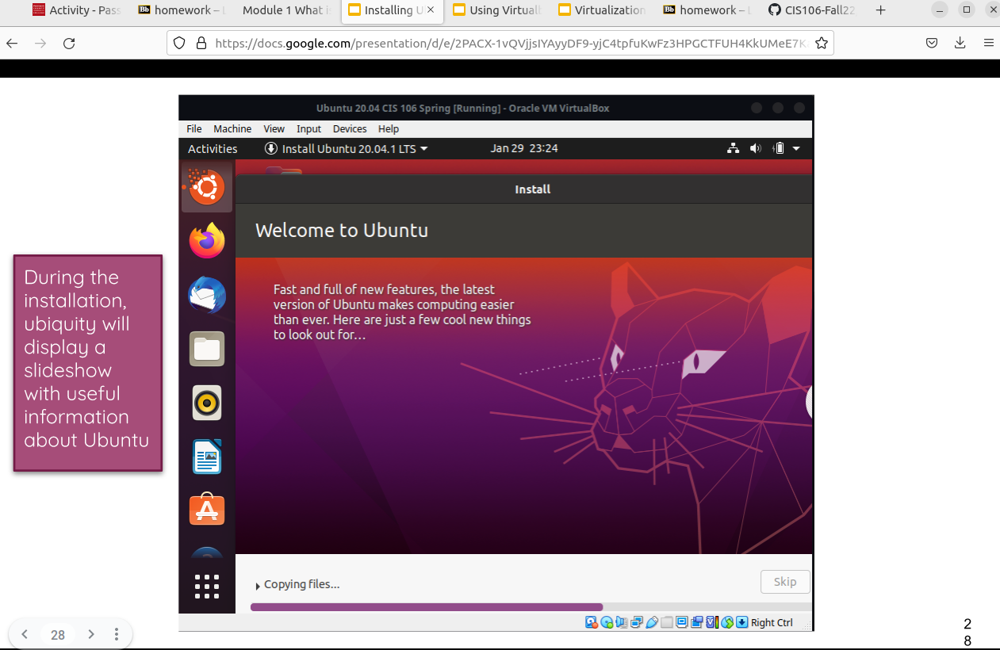
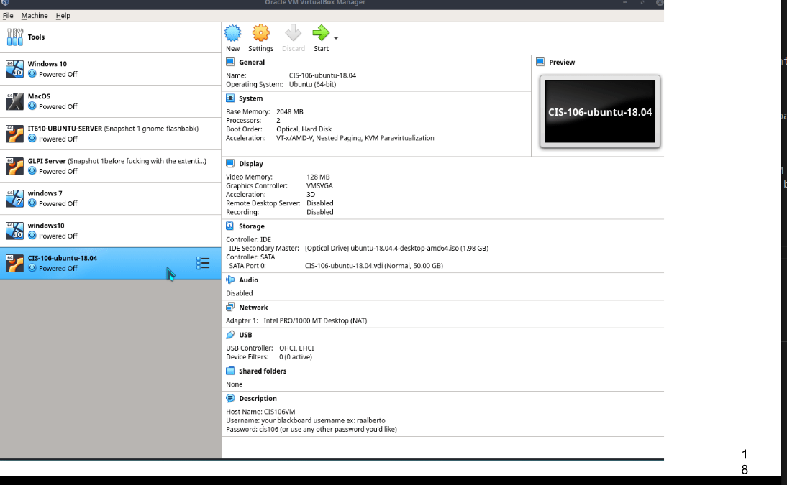

--- 
Andrew Prieto 
CIS 106-Fall 22
---

# Week Report 2

# Summary 
Linux is an open source software meaning it’s free to use.  Leading many people to collaborate with the OS adding their own code. Ubuntu is one of the subbranches made from Linux and had more subbranches made off it.

## What is Virtualization 
Virtualization in simple terms is a “fake” (virtual machine) inside another machine. In other words an application on a client runs an separate OS (Windows, Macos, Linux). It uses some of the hardware from the client but the client isn't affected by anything happening in the VM.

### Types of Virtualization 
There are two types: client side and server side. The client side runs on a physical client's hardware while server side runs on an OS. A VM can allow for multiple OS on a single client and can be used as a controlled environment for testing. There are many types of VM software, the major two being VM ware and Oracle box

#### Ubuntu in Virtualbox 
The image below shows the VM Oraclebox having Ubuntu installed. 
 
##### Important Notes 

When creating a virtual machine a common mistake (including myself) is not giving enough hardware dedicated towards the VM. If given the bare minimum the VM will act slow and cause frustration. Depending on what is being done dedicating at least 4 gigs of memory is good practice, along with a core from the cpu. 
 This would be the recommend minimum setting for using a VM. 

VM's are fun to use and I encourage many people to have at least a VM in their system to try different kinds of OS! My scenario for example Im using a VM to enter and learn the world of Linux. If anything should happen to the VM my client won't be affected so don't be afraid to take a risk or two and learn from it. Just make sure to save a snapshot of your work! 