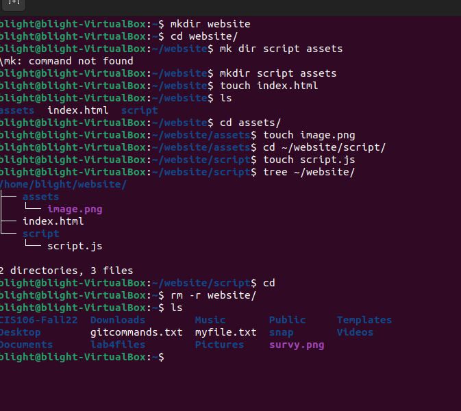
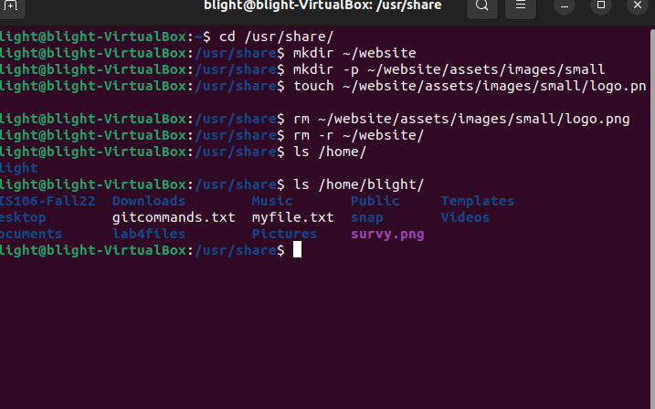
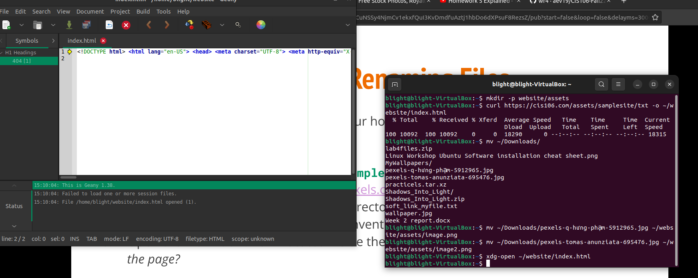
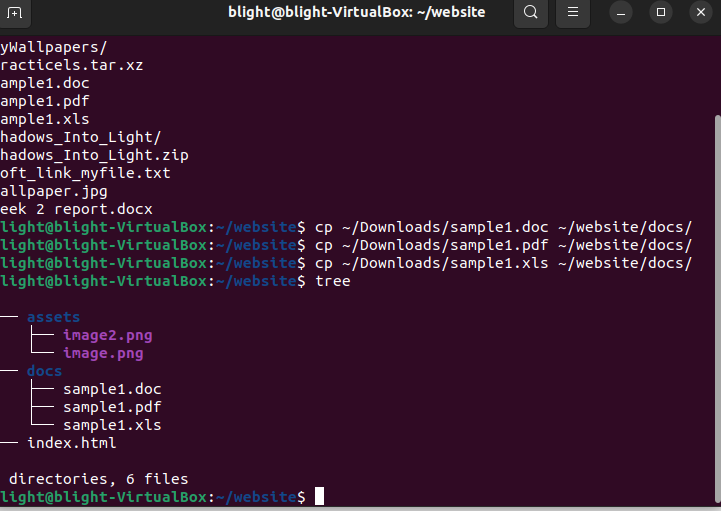

# Week 5 Report 

## Questio 1 
 1. A command option are options that modify/enhance the commands behavior.
 2. An arguemnt are items open that the command acts on.
 3. The mkdir is used to make directories. 
    1. mkdir School
    2. mkdir wallpapers/ocean 
    3. mkdir ~/ Wallpapers/forest 
 4. The touch commands is used to make files 
    1. touch Slient_Hill
    2. touch Gumball.txt
    3. touch ~/Downloads/games.txt
 5. rm removes files 
    1. rm Slient_hill
 6. rmdir removes empty directories while rm -r removes non empty directories. 
    1. rmdir school 
    2. rm -r Wallpapers
    3. rm -r ~/Downloads/games
 7. the mv allows you to move and rename a file. When renameing you must put a source then destination file along with the new name. CP allows you to copy files, -r is used to copy directories. 
    1. mv Downloads/homework.pdf Documents 
    2. mv ~/Downloads/homework.docx ~/Downloads/Cis106homework.docx
    3. CP Downloads/wallpapaers.zip Pictures/ 
    4. cp -r ~/Downloads/wallpapers ~/Pictures/
   
### Question 2 

